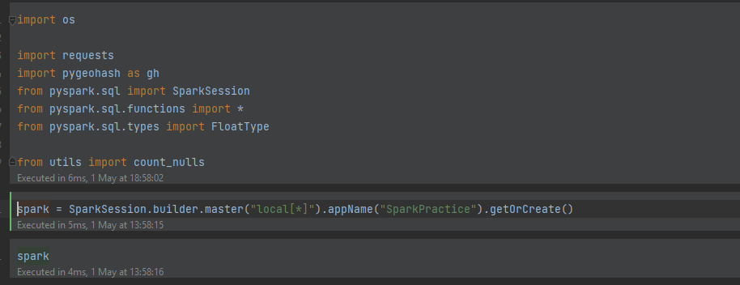

### Spark is initialized with above configuration

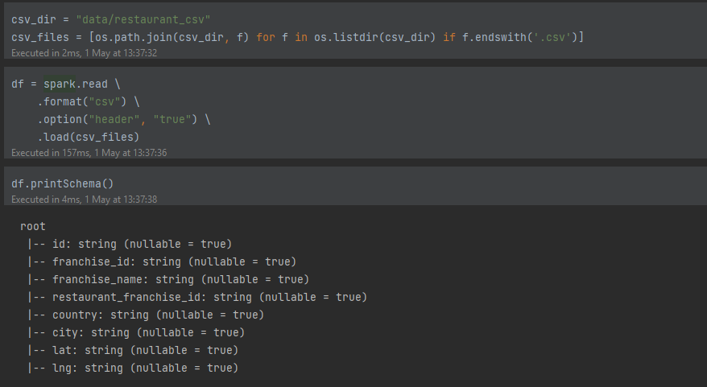

### restaurant data is loaded into spark dataframe

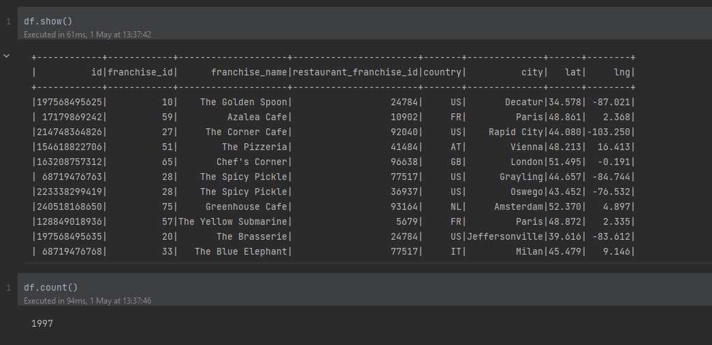

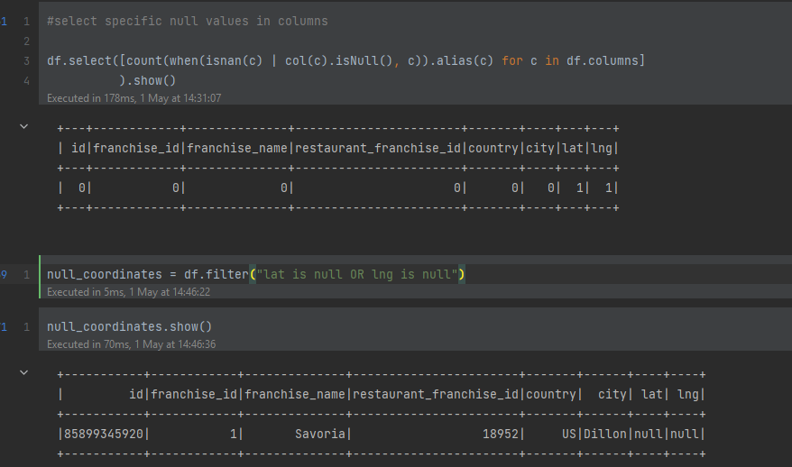

### as you can see from the data there are some null values in the lat and lng columns

### now we will use the fillna function to fill the null values with opencage api

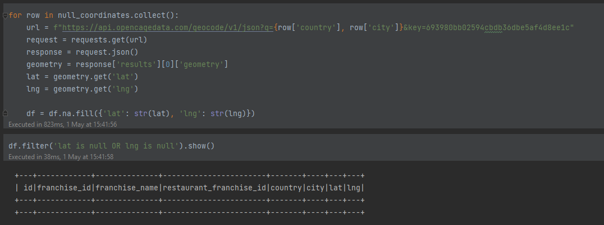

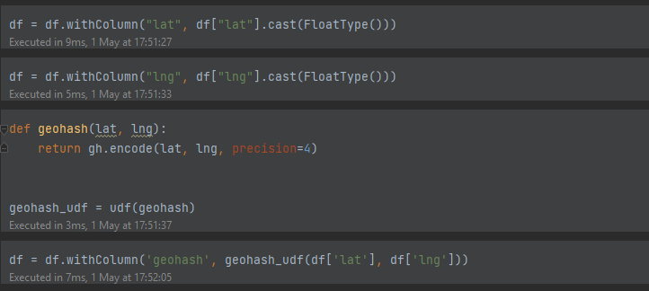

### we convert type of lat and lng from string to float type and apply geohash function to add geohash column

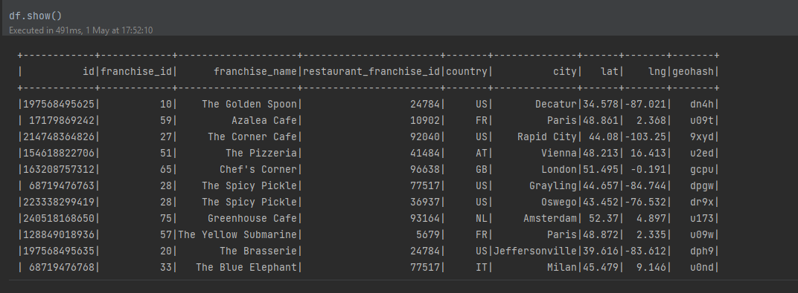

# Whether data exploration

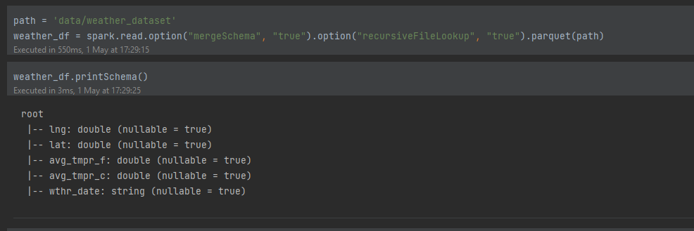

### weather data is loaded into spark dataframe

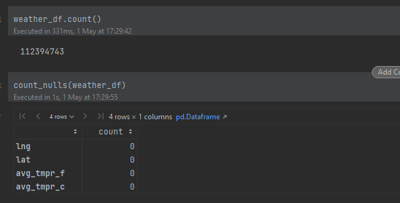

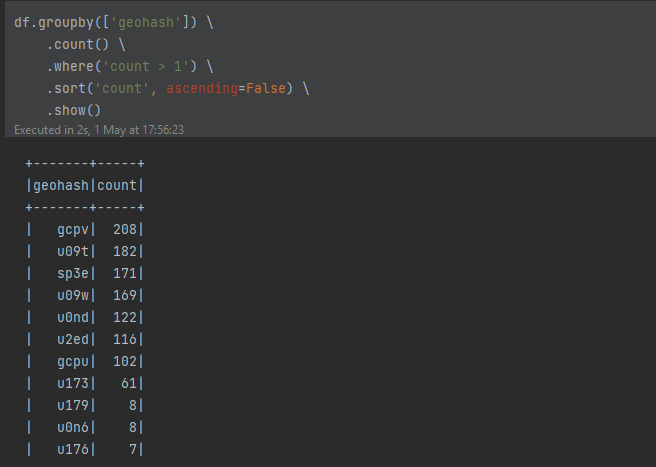

### as you can see there are many duplicate values in the weather data now we will remove the duplicates

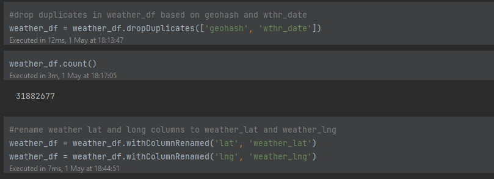

### duplicates are removed and lat and lng columns are renamed to weather_lat and weather_lng to avoid confusion and duplicate error

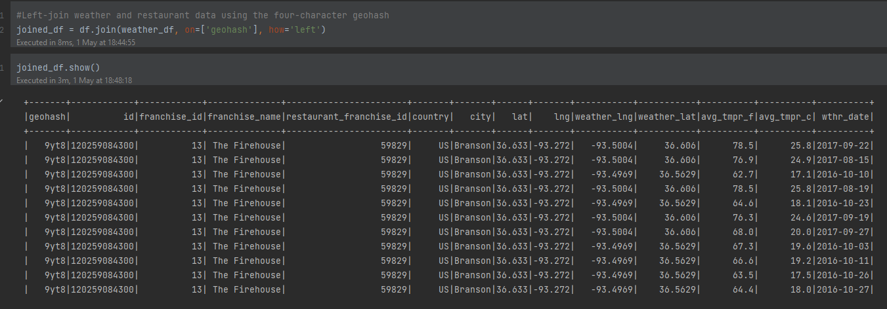

### we left-joined two dataframes based on lat and lng columns

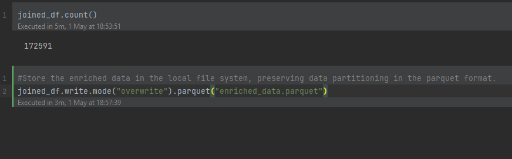

### the result of join is stored as parquet file